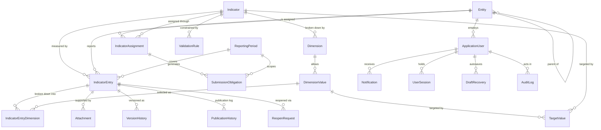

# 03 — Domain Model

All types live in [src/IndicatorsManagement.Domain/](../src/IndicatorsManagement.Domain/).
Persistence mapping is in
[IndicatorsDbContext.cs](../src/IndicatorsManagement.Infrastructure/Data/IndicatorsDbContext.cs);
the physical schema is described in [07-database.md](07-database.md).

## Base type

```csharp
public abstract class BaseEntity
{
    public int Id { get; set; }
    public DateTime CreatedAt { get; set; } = DateTime.UtcNow;
    public DateTime UpdatedAt { get; set; } = DateTime.UtcNow;
}
```

Nine entities derive from it. Seven do not and declare their own `Id` — `Attachment`,
`AuditLog` (which uses `long`), `DraftRecovery`, `Notification`, `SystemConfiguration`,
`UserSession`, `VersionHistory`. That inconsistency is finding **C1**; it is cosmetic but
means "does this type have `UpdatedAt`?" cannot be answered without looking.

## Entity relationship map



## Master data

### `Entity` — جهة → table `entities`

A government body. Self-referencing: the Ministry is the root and the other fourteen
point at it via `ParentEntityId`.

| Field | Type | Notes |
|---|---|---|
| `NameAr` | string(255) | Required, **unique** |
| `NameEn` | string(255)? | Optional |
| `Type` | `EntityType` | Stored as string |
| `ParentEntityId` | int? | Self-FK, `NoAction` |
| `Status` | string(20) | `"active"` / anything else. Default `"active"` |

`Status` is a magic string, not an enum — finding **C2**. Entity deactivation is checked
in `IndicatorEntryService.CreateEntryAsync`, which refuses entries for a non-`"active"`
entity.

`EntityType`: `Ministry`, `Bureau`, `Authority`, `Department`, `Administration`, `Fund`,
`Network`.

### `Indicator` — مؤشر → table `indicators`

*What* is being measured.

| Field | Type | Notes |
|---|---|---|
| `Code` | string(50) | Required, **unique**. e.g. `F001`, `CR003` |
| `NameAr` / `NameEn` | string(255) | Arabic required |
| `DefinitionAr` | text | Required — what the number means |
| `CalculationMethodAr` | text | Required — how it is derived |
| `UnitAr` | string(100) | Required — عدد, نسبة مئوية, دينار … |
| `DataSourceAr` | text | Required — where the figure comes from |
| `ObjectiveAr` | text? | Why it is tracked |
| `PublicationFrequency` | `PublicationFrequency` | Monthly / Quarterly / Semi_Annual / Annual |
| `IsActive` | bool | Default `true` |
| `RequiresAttachment` | bool | Blocks submission without a file |
| `RequiresReview` | bool | Default `true` |
| `CreatedBy` | int? | FK to user, `SetNull` on delete |

Seeded codes group by owning entity: `F` food security, `CR` commercial registry,
`CA` commercial agencies, `IC` international cooperation, `X` exports, `I` insurance,
`V` investment, `M` capital market, `W` women's empowerment, `LTN` trade network,
`C`, `D`, `E`, `O` for the remainder — 120 in total.

### `Dimension` / `DimensionValue` — بُعد → `dimensions`, `dimension_values`

An optional breakdown axis on an indicator: by sector, by country, by facility type.
`DimensionType` is `Single_Select`, `Multi_Select`, or `Numeric`. `(IndicatorId,
DimensionNameAr)` is unique. Both cascade-delete from their parent — the only two
cascades that model true composition.

When an indicator has any `IsMandatory` dimension, `CreateEntryAsync` refuses an entry
that supplies no dimension values at all. Note it does **not** verify that *each*
mandatory dimension is covered — finding **B3**.

### `ReportingPeriod` — فترة إبلاغ → `reporting_periods`

| Field | Notes |
|---|---|
| `PeriodType` | Monthly / Quarterly / Semi_Annual / Annual |
| `Year`, `Month?`, `Quarter?`, `HalfYear?` | Only the relevant one is populated |
| `StartDate`, `EndDate` | `DateOnly` |
| `DisplayNameAr` | "يناير 2026", "الربع 1 - 2026" |
| `IsOpen` | Intended to gate entry against closed periods |

Unique on `(PeriodType, Year, Month, Quarter, HalfYear)`. 57 rows are seeded per the
2024–2026 range: 3 years × (12 monthly + 4 quarterly + 2 semi-annual + 1 annual).

`IsOpen` is stored and indexed but **never checked** when creating or submitting an
entry — finding **B2**.

### `ValidationRule` → `validation_rules`

Per-indicator numeric bounds and mandatory-field flags: `RuleType`, `MinValue`,
`MaxValue`, `IsMandatoryNotes`, `IsMandatoryAttachment`. Enforced in
`SubmitEntryAsync`, not on save — so a Draft may hold an out-of-range value until
submission.

### `SystemConfiguration` → `system_configuration`

Key/value settings, unique on `ConfigKey`. Seeded keys are declared in
[ConfigKeys.cs](../src/IndicatorsManagement.Contracts/Constants/ConfigKeys.cs):
notification thresholds (7/3/1 days), dashboard refresh interval, max upload size (MB),
session timeout (minutes).

## Assignment and obligation

### `IndicatorAssignment` — تكليف → `indicator_assignments`

"Entity X reports indicator Y at frequency Z from `StartDate` until `EndDate`."
`ReportingFrequency` is a `PeriodType`. `IsActive` toggles it without deleting history.

`(IndicatorId, EntityId)` is indexed but **not unique** — overlapping assignments for the
same pair are possible. `CreateEntryAsync` only checks that *some* active, in-date
assignment exists.

### `SubmissionObligation` — التزام تسليم → `submission_obligations`

One concrete due instance: assignment + period + `DueDate` + `Status`. Unique on
`(IndicatorAssignmentId, ReportingPeriodId)`. Generated on demand via
`POST /api/v1/indicator-assignments/{id}/generate-obligations`.

`ObligationStatus`: `Not_Started` → `In_Progress` → `Submitted` → `Approved`, with
`Overdue` set by the nightly job. Driven by `IndicatorEntryService.UpdateObligationStatus`
at create, submit, and final approval.

## Transactional core

### `IndicatorEntry` — إدخال → `indicator_entries`

The centre of the system.

| Field | Type | Notes |
|---|---|---|
| `IndicatorId`, `EntityId`, `ReportingPeriodId` | int | The coordinates |
| `ValueNumeric` | decimal(18,4)? | The measurement |
| `ValueText` | string? | For non-numeric indicators |
| `UnitSnapshot` | string(100)? | Copy of `Indicator.UnitAr` at entry time |
| `WorkflowState` | `WorkflowState` | Default `Draft` |
| `PublicationStatus` | `PublicationStatus` | Default `Unpublished` |
| `VersionNo` | int | Starts at 1 |
| `IsDeleted` | bool | Soft delete |
| `Notes`, `Source`, `RejectionReason` | string? | |
| `EnteredBy` / `EnteredAt` | | Author |
| `SubmittedAt` | | |
| `ReviewedBy` / `ReviewedAt` | | Set on reject and return |
| `EntityApprovedBy` / `EntityApprovedAt` | | Level 1 |
| `MinistryApprovedBy` / `MinistryApprovedAt` | | Level 2 |

**`UnitSnapshot` matters.** It freezes the unit as it was when the value was recorded, so
that renaming an indicator's unit later cannot retroactively change the meaning of
historical data.

**The core invariant** — at most one active entry per `(IndicatorId, EntityId,
ReportingPeriodId)` — is enforced twice: by a filtered unique index in the database, and
by an existence check in `CreateEntryAsync`. The filter
`[IsDeleted] = 0 AND [WorkflowState] != 'Rejected'` is what lets a rejected entry be
replaced by a fresh attempt.

### `IndicatorEntryDimension` → `indicator_entry_dimensions`

The dimensional breakdown of one entry: `DimensionId`, `DimensionValueId?`,
`ValueNumeric?`. Cascades from the entry. On update the service deletes all rows and
re-inserts them rather than diffing.

### `Attachment` → `attachments`

Supporting file: `FileName`, `FilePath`, `FileType`, `FileSize`, `UploadedBy`,
`IsDeleted`. Files land on the local disk under `uploads/{entryId}/{guid}{ext}` — which
does not survive container replacement without a mounted volume (finding **O1**) and is
not scanned or content-verified (finding **S3**).

### `VersionHistory` → `version_history`

`VersionNo`, the value at the time, `WorkflowState` (as a plain string here, not the
enum), `ChangedBy`, `ChangeReason`, `SnapshotJson`.

**The table exists and is mapped, but nothing writes to it** — finding **B4**. There is
no `IVersionHistoryService` and no service call that inserts a row. `VersionNo` on the
entry is set to 1 and never incremented.

## V2.1 additions

### `PublicationHistory` → `publication_history`
`Action` (`"Published"` / `"Unpublished"` as a magic string), `PerformedBy`,
`PerformedAt`, `Reason`. Written by `PublicationService`.

### `TargetValue` — قيمة مستهدفة → `target_values`
Planned figure for `(IndicatorId, Year, EntityId?, DimensionValueId?)`, unique on that
tuple. Nullable `EntityId` means a Ministry-wide target. **No service, no controller, no
UI** — the table is reachable only through direct SQL (finding **B5**).

### `ReopenRequest` — طلب إعادة فتح → `reopen_requests`
Request to amend an approved entry: `Reason`, `Status` (`"Pending"`/`"Approved"`/
`"Rejected"` as strings), `ReviewedBy`, `ReviewNotes`. `NotificationType` already has
`Reopen_Request`, `Reopen_Approved`, `Reopen_Rejected` members. **Also has no service,
controller, or UI** (finding **B5**).

## Identity, audit, and support

### `ApplicationUser`
Extends `IdentityUser<int>` with `EntityId?`, `FullNameAr`, `Phone?`, `IsActive`,
`CreatedAt`, `UpdatedAt`. `EntityId` is the basis of all entity scoping and is issued as
a JWT claim.

### `UserSession` → `user_sessions`
`SessionToken` (the full JWT, up to 2000 chars), `IpAddress`, `UserAgent`,
`LastActivity`, `ExpiresAt`. Checked on every authenticated request. Storing the raw
token rather than a hash is finding **S2**.

### `AuditLog` → `audit_logs`
`long` id. `UserId?`, `EntityType`, `EntityId?`, `ActionType`, `ResultStatus`,
`ErrorCode?`, `ErrorMessage?`, `OldValuesJson?`, `NewValuesJson?`, `IpAddress?`.
Written both by middleware (every write request) and explicitly by services (domain
actions), so a single operation typically produces two rows.

### `Notification` → `notifications`
`NotificationType`, `TitleAr`, `MessageAr`, `RelatedEntityType`/`RelatedEntityId`,
`IsRead`, `SentAt`, `ReadAt`. Indexed on `(UserId, IsRead)`.

`NotificationType`: `Due_Date`, `Overdue`, `Workflow_Change`, `Publication`,
`Reopen_Request`, `Reopen_Approved`, `Reopen_Rejected`.

### `DraftRecovery` → `draft_recovery`
Client-side autosave: `DraftDataJson`, `LastSavedAt`, `ExpiresAt`. Surfaced by
`DraftRecoveryModal` on login; purged weekly.

## Enum reference

| Enum | Members |
|---|---|
| `WorkflowState` | `Draft`, `Under_Review`, `Approved_By_Entity`, `Final_Approved`, `Rejected`, `Returned_For_Modification` |
| `PublicationStatus` | `Unpublished`, `Published` |
| `EntityType` | `Ministry`, `Bureau`, `Authority`, `Department`, `Administration`, `Fund`, `Network` |
| `PeriodType` | `Monthly`, `Quarterly`, `Semi_Annual`, `Annual` |
| `PublicationFrequency` | `Monthly`, `Quarterly`, `Semi_Annual`, `Annual` |
| `DimensionType` | `Single_Select`, `Multi_Select`, `Numeric` |
| `ObligationStatus` | `Not_Started`, `In_Progress`, `Submitted`, `Overdue`, `Approved` |
| `ValidationRuleType` | `Numeric`, `Percentage`, `Currency`, `Count`, `Text` |
| `NotificationType` | `Due_Date`, `Overdue`, `Workflow_Change`, `Publication`, `Reopen_Request`, `Reopen_Approved`, `Reopen_Rejected` |

`PeriodType` and `PublicationFrequency` are member-for-member identical and are mapped
onto each other in `DatabaseSeeder` — finding **C4**.

All enums persist as strings (`.HasConversion<string>()`), so the database is readable
and reordering members cannot silently corrupt data. See
[ADR-0004](adr/0004-enums-as-strings-in-database.md).

## Invariants

Rules the system depends on. Where they are enforced, and where they are not:

| # | Invariant | Enforced by | Status |
|---|---|---|---|
| I1 | At most one active entry per (indicator, entity, period) | Filtered unique index + service check | ✅ Both |
| I2 | An entry only advances along legal state transitions | Service guards on each action | ✅ Service only |
| I3 | Entry is editable only in `Draft` or `Returned_For_Modification` | `UpdateEntryAsync` | ✅ Service only |
| I4 | Entry is deletable only in `Draft` | `SoftDeleteEntryAsync` | ✅ Service only |
| I5 | Indicator `Code` is unique | Unique index | ✅ Database |
| I6 | Entity `NameAr` is unique | Unique index | ✅ Database |
| I7 | Entry cannot be created for a deactivated entity | `CreateEntryAsync` | ✅ Service only |
| I8 | Entry requires an active, in-date assignment | `CreateEntryAsync` | ✅ Service only |
| I9 | Submission requires an attachment when the indicator demands one | `SubmitEntryAsync` | ✅ Service only |
| I10 | Value respects the indicator's min/max | `SubmitEntryAsync` | ⚠️ Only at submit |
| I11 | Entry cannot be created for a closed period | — | ❌ **Not enforced** (B2) |
| I12 | Every mandatory dimension receives a value | — | ⚠️ **Partial** (B3) |
| I13 | Every approved entry has a version history row | — | ❌ **Not implemented** (B4) |

Invariants marked "Service only" hold as long as every write goes through the service
layer. `AttachmentsController` bypasses it (finding **A2**), which is why that matters.
