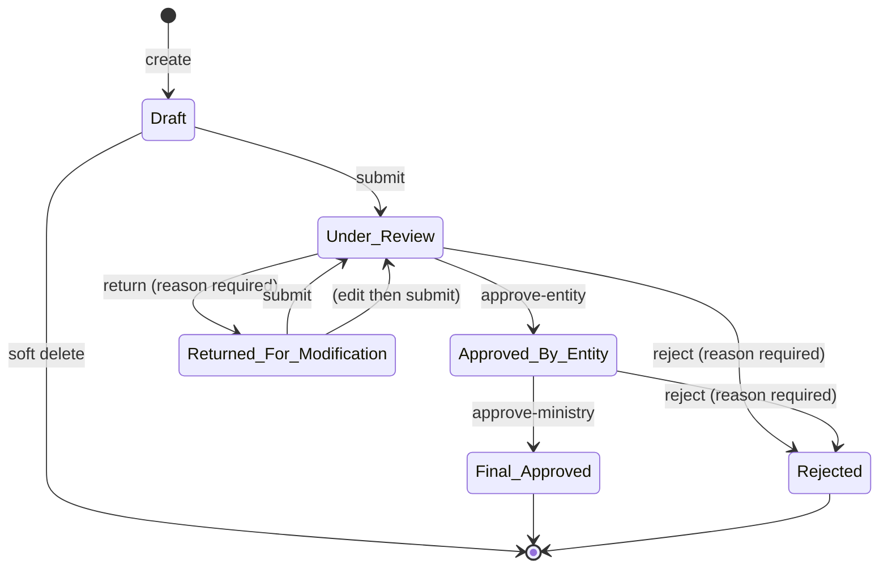

# 04 — Workflows

The behavioural heart of the system. Implementation:
[IndicatorEntryService.cs](../src/IndicatorsManagement.Infrastructure/Services/IndicatorEntryService.cs)
and [PublicationService.cs](../src/IndicatorsManagement.Infrastructure/Services/PublicationService.cs).

## 1. The approval workflow

### State machine



### Transition table

Every guard below is a real check in the service; an illegal attempt returns
`ApiResponse.Fail` with an Arabic message, not an exception.

| Action | From | To | Roles | Guards | Side effects |
|---|---|---|---|---|---|
| **create** | — | `Draft` | Super_Admin, Entity_Admin, Data_Entry_User | Entity is `"active"`; an active in-date assignment exists; no active entry for the same triple; mandatory dimensions supplied | Snapshots `UnitAr`; obligation → `In_Progress`; audit |
| **update** | `Draft`, `Returned_For_Modification` | unchanged | same | State must be editable | Replaces all dimension rows; audit with old/new |
| **soft delete** | `Draft` | — | same | `Draft` only | Cascades `IsDeleted` to attachments; audit |
| **submit** | `Draft`, `Returned_For_Modification` | `Under_Review` | same | Attachment present if required; value within min/max; notes present if required | Sets `SubmittedAt`; obligation → `Submitted`; notifies entity users; audit |
| **approve-entity** | `Under_Review` | `Approved_By_Entity` | Super_Admin, Entity_Admin, Reviewer | Must be `Under_Review` | Stamps `EntityApprovedBy/At`; notifies author **and all Ministry admins**; audit |
| **approve-ministry** | `Approved_By_Entity` | `Final_Approved` | Super_Admin, Ministry_Admin | Must be `Approved_By_Entity` | Stamps `MinistryApprovedBy/At`; obligation → `Approved`; notifies author and entity; audit |
| **return** | `Under_Review` | `Returned_For_Modification` | Super_Admin, Ministry_Admin, Entity_Admin, Reviewer | **Reason required** | Stores reason in `RejectionReason`; stamps `ReviewedBy/At`; notifies author; audit |
| **reject** | `Under_Review`, `Approved_By_Entity` | `Rejected` | Super_Admin, Ministry_Admin, Entity_Admin, Reviewer | **Reason required** | Stores reason; stamps `ReviewedBy/At`; notifies author and entity; audit |

### Why `Rejected` is terminal

A rejected entry is never edited back into life. It stays as a permanent record of the
attempt, and because the unique index excludes `Rejected` rows, the entity can create a
fresh entry for the same period. `Returned_For_Modification` is the path for "this needs
fixing"; `Rejected` is the path for "this was wrong to submit". See
[ADR-0002](adr/0002-two-level-approval-workflow.md).

### Approval and authorship

**The service does not prevent a user from approving their own entry.** A user holding
both `Data_Entry_User` and `Reviewer` — or an `Entity_Admin`, who can both create and
approve — can walk an entry from `Draft` to `Approved_By_Entity` alone. Only the
Ministry level is guaranteed to be a different person, and only because
`Ministry_Admin` is a distinct role. This is finding **S4**; whether it is a defect
depends on ministry policy, so it is documented rather than silently changed.

### Known gaps

- **Closed periods are not enforced.** `ReportingPeriod.IsOpen` is never consulted; an
  entry can be created against a closed period (finding **B2**).
- **Mandatory dimensions are only partly checked.** The service requires *some*
  dimension when any mandatory dimension exists, not one per mandatory dimension
  (finding **B3**).
- **No version history is written.** `version_history` stays empty and `VersionNo` never
  leaves 1 (finding **B4**).
- **Validation runs at submit, not at save.** A `Draft` may hold an out-of-range value.
  Deliberate — drafts are working documents — but worth knowing.

## 2. Publication

Publication is a **separate axis** from approval. `PublicationStatus` is
`Unpublished` or `Published` and changes independently of `WorkflowState`.

```
WorkflowState:      Draft → Under_Review → Approved_By_Entity → Final_Approved
                                                                       │
PublicationStatus:  Unpublished ──────────────────────── publish ──────┴──→ Published
                                 ←─────────── unpublish ──────────────────
```

| Action | Endpoint | Roles |
|---|---|---|
| Publish one | `POST /api/v1/indicator-entries/{id}/publish` | Super_Admin, Ministry_Admin |
| Unpublish one | `POST /api/v1/indicator-entries/{id}/unpublish` | Super_Admin, Ministry_Admin |
| Publish many | `POST /api/v1/indicator-entries/bulk-publish` | Super_Admin, Ministry_Admin |
| Unpublish many | `POST /api/v1/indicator-entries/bulk-unpublish` | Super_Admin, Ministry_Admin |
| History | `GET /api/v1/indicator-entries/{id}/publication-history` | Any authenticated |
| Statistics | `GET /api/v1/publication/statistics` | Super_Admin, Ministry_Admin |

Every publish and unpublish appends a `publication_history` row with actor, timestamp,
and optional reason. The `Viewer` role sees published entries only — `GetEntriesAsync`
takes a `publishedOnly` flag that the controller sets from the caller's role.

Rationale in [ADR-0003](adr/0003-publication-separate-from-approval.md): approval is a
statement about *correctness*, publication is a decision about *disclosure*. They have
different owners and different timing, so conflating them into one enum would force the
Ministry to choose between "approved but not yet announced" and "not approved".

## 3. Submission obligations

An assignment says an entity reports an indicator quarterly. An **obligation** is one
concrete instance of that: "Q1 2026, due 2026-04-15".

```
IndicatorAssignment ──generate-obligations──> SubmissionObligation (one per period)
```

Generated on demand:
`POST /api/v1/indicator-assignments/{id}/generate-obligations` (Super_Admin,
Ministry_Admin).

Status transitions, driven by entry activity:

```
Not_Started ──entry created──> In_Progress ──submitted──> Submitted ──ministry approved──> Approved
     │                              │
     └────── past due date ─────────┴────> Overdue   (set by the nightly job)
```

## 4. Notifications

Two channels for the same event: an in-app `notifications` row, and — when SMTP is
configured — an email. `EmailService` logs a warning and returns silently when
`Smtp:Host` is empty, so the system runs fine without mail.

| Trigger | Type | Recipients |
|---|---|---|
| Entry submitted | `Workflow_Change` | All active users of the entity |
| Approved at entity level | `Workflow_Change` | Author **+ every Ministry_Admin and Super_Admin** |
| Final approval | `Workflow_Change` | Author + all entity users |
| Returned | `Workflow_Change` | Author, with the reason |
| Rejected | `Workflow_Change` | Author + all entity users, with the reason |
| 7/3/1 days before due | `Due_Date` | Entity users with the obligation |
| Past due | `Overdue` | Entity users + Ministry admins |
| Publish / unpublish | `Publication` | Per `PublicationService` |

**Notification fan-out is N+1.** `NotifyEntityUsersAsync` loops over user ids and awaits
one insert each; `NotifyMinistryAdminsAsync` does the same across all Ministry admins.
On a large entity this is slow and produces a burst of round-trips — finding **P2**.

## 5. Background jobs

Registered at the bottom of [Program.cs](../src/IndicatorsManagement.Api/Program.cs),
stored in the Hangfire database, retried 3 times with 60 s / 300 s / 900 s backoff.

| Job | Schedule | What it does |
|---|---|---|
| `DueDateNotificationJob` | `0 8 * * *` (08:00 daily) | For each of 7, 3, 1 days ahead, finds obligations due then that are still `Not_Started`/`In_Progress` and notifies |
| `OverdueNotificationJob` | `0 9 * * *` (09:00 daily) | Flips past-due obligations to `Overdue` and notifies |
| `SessionCleanupJob` | hourly | Deletes `user_sessions` rows past `ExpiresAt` |
| `DraftCleanupJob` | weekly | Deletes `draft_recovery` rows past `ExpiresAt` |

The Hangfire dashboard is at `/hangfire`, gated by `HangfireDashboardAuthFilter`.

**The thresholds are hardcoded** as `new[] { 7, 3, 1 }` in `DueDateNotificationJob`,
even though `system_configuration` holds `NotificationThreshold_Days_7/3/1` for exactly
this purpose. Changing the config has no effect — finding **B6**.

## 6. Draft recovery

An unsaved entry form autosaves to `draft_recovery` as JSON keyed by
`(UserId, IndicatorId, EntityId, ReportingPeriodId)`. On next login `DraftRecoveryModal`
offers to restore it. Rows expire and are swept weekly.

```
POST   /api/v1/drafts/save      save or overwrite
GET    /api/v1/drafts/recover   list this user's recoverable drafts
DELETE /api/v1/drafts/{id}      discard
```

## 7. Sessions

Login issues a JWT **and** inserts a `user_sessions` row holding that exact token.
Every authenticated request afterwards passes through `SessionValidationMiddleware`,
which requires:

1. a `user_sessions` row whose `SessionToken` equals the presented token,
2. `ExpiresAt` in the future,
3. `LastActivity` within `SessionTimeout_Minutes` (default 30, from configuration),

then updates `LastActivity`. Failing any check deletes the row and returns 401 with an
Arabic explanation. Logout deletes the row, so a stolen token dies immediately rather
than at natural JWT expiry.

The cost is a read plus a write to `user_sessions` on **every** authenticated request —
finding **P1**. Rationale in
[ADR-0005](adr/0005-server-side-session-validation.md).

## 8. Reopen — designed, not built

`reopen_requests` is mapped, `NotificationType` carries `Reopen_Request`,
`Reopen_Approved`, and `Reopen_Rejected`, and the V2.1 plan describes the flow. There is
no service, no controller, and no UI. Today a `Final_Approved` entry cannot be amended
through the application at all. Finding **B5**.

Intended shape, for whoever implements it:

```
Final_Approved ──request reopen (reason)──> ReopenRequest{Pending}
   Ministry_Admin approves  → entry returns to an editable state, VersionNo increments,
                              a version_history row records the previous value
   Ministry_Admin rejects   → entry unchanged, requester notified
```

Implementing it should also close **B4** (version history), since the two are the same
mechanism.
